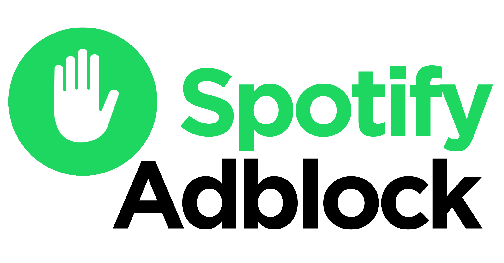

  

  
---
#### Block ad when using Spotify on Browser: https://open.spotify.com/
---  
  
## Usage
1. Install one of the adblock extension. Example:
<a href="https://getadblock.com/">AdBlock</a> | 
<a href="https://adblockplus.org/">AdBlock Plus</a> | 
<a href="https://github.com/gorhill/uBlock">uBlock Origin</a> | 
<a href="https://adguard.com/en/adguard-browser-extension/overview.html">AdGuard</a>

2. Subscribe <a href="https://dunggramer.github.io/spotify-adblock/"> Spotify Adblock </a>
3. Enjoy!
